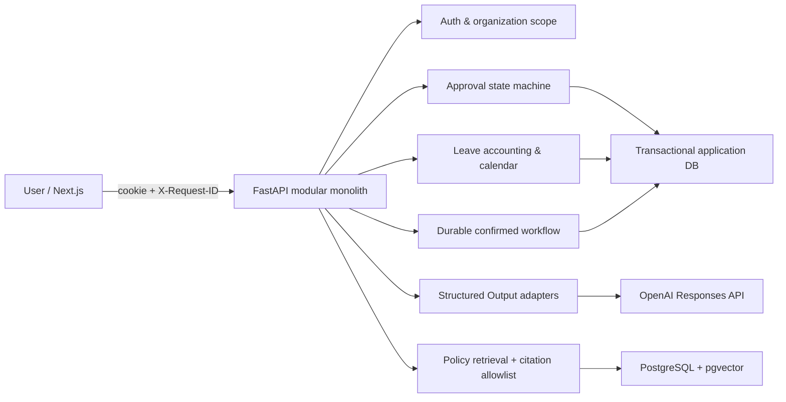
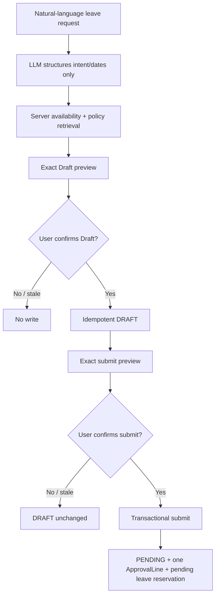

# JHWorks AI Groupware — Architecture and Control Evidence

## Portfolio Summary

JHWorks는 synthetic 조직·정책·업무 데이터로 만든 AI 전자결재 포트폴리오다. 핵심 설계 질문은 “LLM이 편리한
자연어 인터페이스를 제공하면서도 권한, 정책 근거, 휴가 회계와 데이터 변경은 어떻게 결정적으로 통제할 것인가”다.

사용자는 일반/출장/휴가 결재를 직접 작성하거나 AI의 도움을 받을 수 있다. AI는 의미 검토·의도·날짜 구조화와
읽기 Tool 선택을 담당하지만, 서버가 권한·필수값·금액·정책 rule·휴가 차감·상태 전이를 다시 계산한다. 쓰기는
exact preview와 사용자 확인을 두 번 거치며 durable workflow가 중단점을 보존한다.

## System Architecture



## Confirmed Leave Write Path



## Control Matrix

| Risk | Control | Evidence |
| --- | --- | --- |
| LLM이 권한이나 상태를 결정 | actor-scoped service와 command endpoint가 재검증 | 다른 actor/token 변조 integration tests |
| 허위 정책 인용 | active policy section allowlist와 stable citation key | policy retrieval 6/6 live eval |
| prompt injection | untrusted prompt/RAG 경계, 좁은 schema, revision scrub | 필수 injection eval과 deterministic tests |
| 확인 뒤 데이터 변경 | preview/account/calendar/manager/policy fingerprint 재검증 | Draft/submit stale tests |
| 재시도 중 중복 제출 | confirmation ID unique constraint와 transactional convergence | replay/concurrency tests |
| 휴가 잔여 초과 | 서버 계산과 LeaveAccount row locking | submit/approve/reject accounting tests |
| 장애 진단 중 개인정보 노출 | 제한된 request ID와 secret-free JSON logs | operational readiness tests |
| 잘못된 production 설정 | JWT/cookie/PostgreSQL/HTTPS startup validation | production settings tests |
| 배포와 schema 변경 결합 | migration single-run job, readiness, smoke, digest rollback | release runbook + container smoke |
| 모델 품질 드리프트 | capability threshold + mandatory safety cases | `artifacts/evals/latest.json` |

## Verified Evidence

```bash
pnpm validate
pnpm eval:all
pnpm smoke:deployment
```

- 실제 모델 평가: 5/5 capability, 29/29 case, 모든 필수 safety case 통과
- backend: lint, strict mypy, 108 tests
- frontend: ESLint, strict TypeScript, Next.js production build
- delivery: API/web OCI image build, migration/seed 분리, 실제 container rehearsal smoke 4/4

평가·smoke report는 local artifact이며 prompt 원문과 secret을 포함하지 않는다. 실제 API 비용이 드는 평가는 일반
PR CI와 분리하고, deterministic tests와 container smoke는 CI에서 실행한다.

## Deliberate Trade-offs

- 고정된 휴가 workflow는 별도 orchestration framework보다 application DB state machine을 사용해 Approval/Leave
  transaction과 하나의 source of truth를 유지했다.
- 현재 인증은 synthetic demo 계정과 HttpOnly cookie다. 실제 조직 배포에는 SSO, account lifecycle, CSRF 전략과
  중앙 audit export가 추가로 필요하다.
- cloud provider를 저장소에 고정하지 않았다. 대신 OCI image, managed PostgreSQL, secret injection, single-run
  migration, readiness와 digest rollback이라는 이식 가능한 release 계약을 명시했다.
- public hosting과 실제 domain은 비용·계정·운영 책임이 필요한 별도 결정이다. 이 문서는 배포 가능한 상태와
  재현 가능한 release rehearsal까지만 증명한다.
